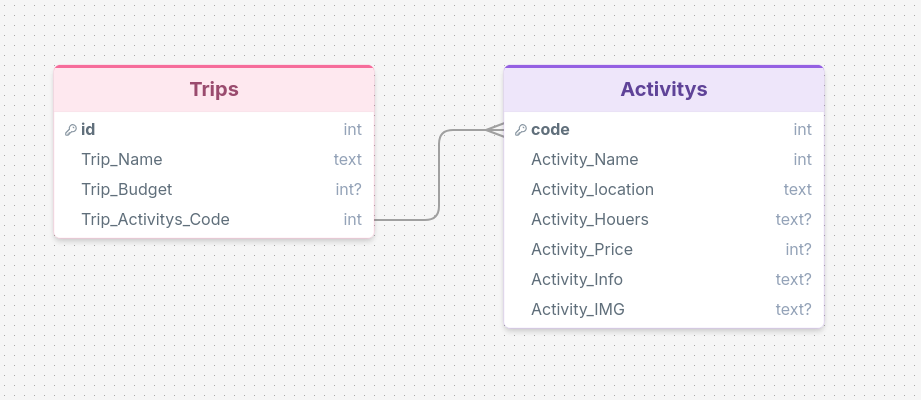

# Sprint 1 - Developing a DB and UI Prototype

## Sprint Goals

Develop a design for the database and a UI prototype that simulates the key functionality of the system. Test and refine the UI so that it can serve as the model for the next phase of development in Sprint 2.

### Specific Goals

<!-- Edit these goals as needed -->

- Design the database:
  - Tables
  - Fields / types
  - Primary keys
  - Default / nullable values
  - Relationships (foreign keys)
- Design the UI
  - Key pages
  - User interactions and 'flow'
  - Page layouts / features
  - Colour palette
  - Etc.

## Initial Database Design

The database will store the information required for users to create and manage road trip plans. It will need to store information about trips, locations, activities, and costs. The database will use primary keys to identify individual records and foreign keys to create relationships between related data.

The database will also be designed with future proofing in mind so that features such as weather, accommodation, or live traffic can be added later.

### Required Data Input

The user will input information about their road trip, including trip details, locations, activities, activity costs, and fuel costs. This information will be entered through the UI and stored in the database.

### Required Data Output

The system will display the user's trip plans, locations, activities, activity costs, fuel costs, and estimated total trip cost.

The system will also display the calculated driving route and allow the route to be exported to Google Maps.

### Required Data Processing

The system will process the entered activity and fuel costs to calculate the estimated total cost of the trip.

The system will process the locations entered by the user to calculate the shortest route between locations.

## UI 'Flow'

The first stage of prototyping was to explore how the UI might 'flow' between states, based on the required functionality.

This Figma demo shows the initial design for the UI 'flow':

**FIGMA FLOW - PLACE THE FIGMA EMBED CODE HERE - MAKE SURE IT IS SET SO THAT EVERYONE CAN ACCESS IT**

### Testing

Replace this text with notes about what you did to test the UI flow and the outcome of the testing.

### Changes / Improvements

Replace this text with notes any improvements you made as a result of the testing.

*IMPROVED FIGMA FLOW - PLACE THE FIGMA EMBED CODE HERE - MAKE SURE IT IS SET SO THAT EVERYONE CAN ACCESS IT*

## Initial UI Prototype

The next stage of prototyping was to develop the layout for each screen of the UI.

This Figma demo shows the initial layout design for the UI:

*FIGMA PROTOTYPE - PLACE THE FIGMA EMBED CODE HERE - MAKE SURE IT IS SET SO THAT EVERYONE CAN ACCESS IT*

### Testing

Replace this text with notes about what you did to test the UI flow and the outcome of the testing.

### Changes / Improvements

Replace this text with notes any improvements you made as a result of the testing.

*FIGMA IMPROVED PROTOTYPE - PLACE THE FIGMA EMBED CODE HERE - MAKE SURE IT IS SET SO THAT EVERYONE CAN ACCESS IT*

## Refined UI Prototype

Having established the layout of the UI screens, the prototype was refined visually, in terms of colour, fonts, etc.

This Figma demo shows the UI with refinements applied:

*FIGMA REFINED PROTOTYPE - PLACE THE FIGMA EMBED CODE HERE - MAKE SURE IT IS SET SO THAT EVERYONE CAN ACCESS IT*

### Testing

Replace this text with notes about what you did to test the UI flow and the outcome of the testing.

### Changes / Improvements

Replace this text with notes any improvements you made as a result of the testing.

*FIGMA IMPROVED REFINED PROTOTYPE - PLACE THE FIGMA EMBED CODE HERE - MAKE SURE IT IS SET SO THAT EVERYONE CAN ACCESS IT*

## Sprint Review

Replace this text with a statement about how the sprint has moved the project forward - key success point, any things that didn't go so well, etc.

